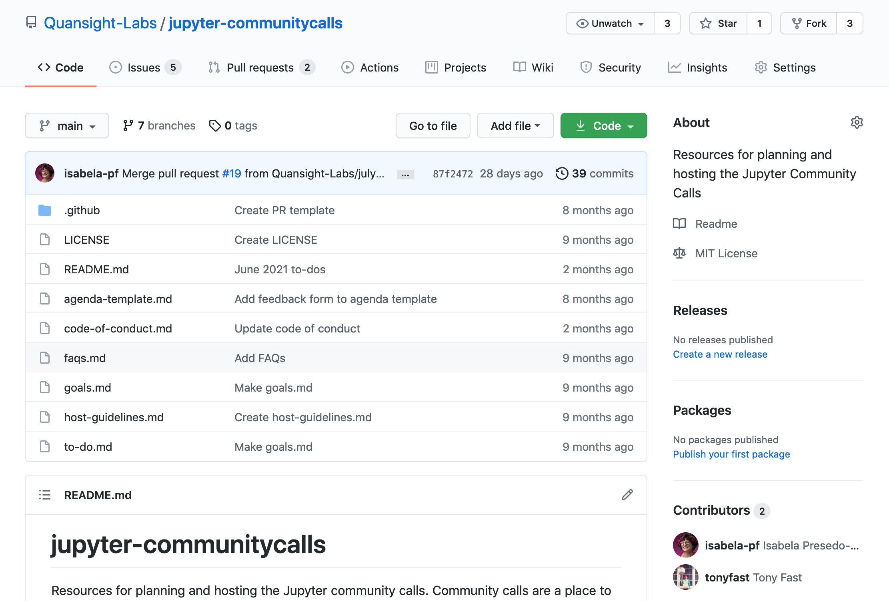
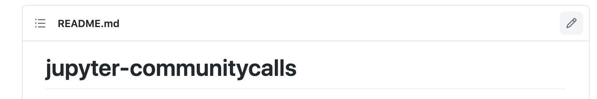
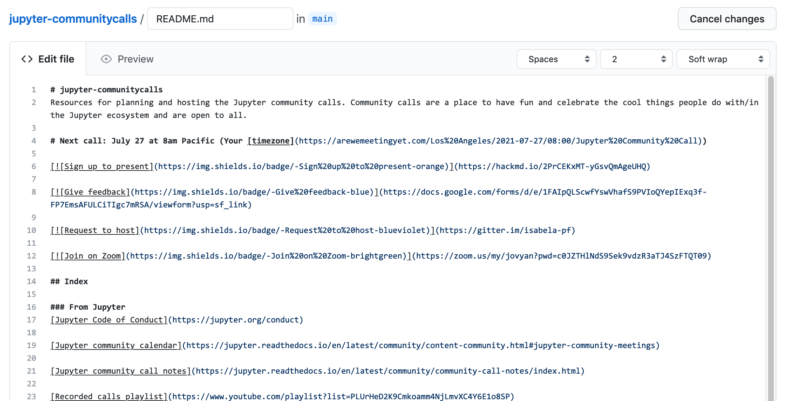
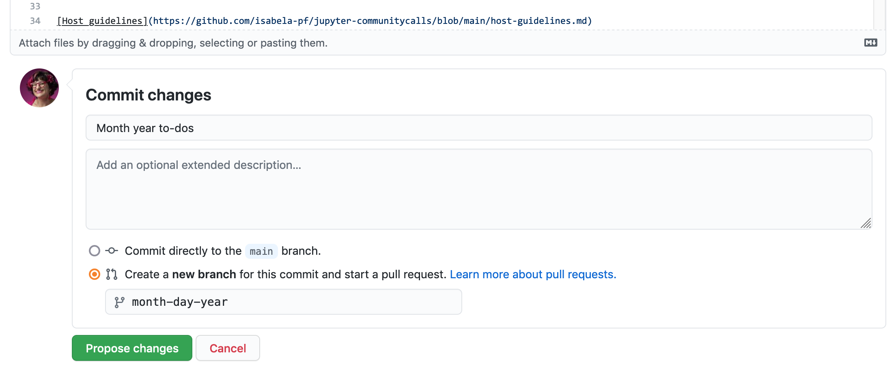
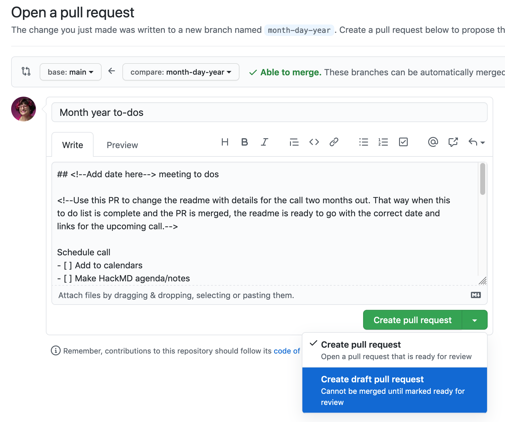

# How to use the Jupyter community call repository

## As a community call participant
This repository is for you to have a central place that stores up-to-date Jupyter community call info and resources. [`readme.md`](https://github.com/Quansight-Labs/jupyter-communitycalls/#readme) is the best place to start.

## As a host and/or community call organizer
This repository has resources to support community call planning. The [For Hosts](https://github.com/Quansight-Labs/jupyter-communitycalls/#for-hosts) section of the `readme` has files that may help during calls. Organizing events happens via pull requests (PRs). That is the focus of the rest of this document.

### Organizing a community call via pull request

Each call’s to-dos are organized as a PR. These PRs are made as soon as a community call ends so that the `readme.md` always has up-to-date info for community members relying on the repo.

1. Edit `readme.md`
This can be done on a fork of this repo, or you can edit directly via GitHub. You can find [instructions for forking the repo and submitting a PR here](https://docs.github.com/en/github/collaborating-with-pull-requests/proposing-changes-to-your-work-with-pull-requests/creating-a-pull-request). You may also follow the instructions below to edit directly on GitHub. 

First, make sure you are on the appropriate repository. If you have write access to jupyter-communitycalls, you can work directly from the jupyter-communitycalls repository. If you do not have write access, select the Fork button in the upper right of the repository and navigate to your newly-forked repository.

Second, navigate to `readme.md`. It will be previewed at the root of the repository by default. Click the edit button (shaped like a pencil) in the upper right of the previewed file.

Clicking the edit button opens the GitHub file editing interface. 

2. On `readme.md`, change the date of the call to two months out, update the timezone link, and update both instances of the agenda link.

Note: PRs always edit the dates to be a full month ahead so that they have accurate information on the main branch (the one that is displayed by deafult) while the next call is being planned. For example, if you are organizing a community call for January and want to create the list of to-dos/a PR for January, you would edit `readme.md` to have information for the February community call.

When making a commit, please format it as `Month Year to-dos`. For example, a commit for January calls could be `January 2021 to-dos`.

If you are editing `readme.md` directly on GitHub, make sure to select the radio button that commits your changes on a new branch.

3. Submit a draft PR to [`jupyter-communitycalls`](https://github.com/Quansight-Labs/jupyter-communitycalls) using the PR template to create the to-do list for the next call.

Add any special to-dos for this specific call as you see fit. If it references any issues, please add `#` followed by the apporpriate issue number somewhere in the description.

4. Complete all the to-dos and check them off on the draft PR until complete.

5. Once the to-dos are all complete and the call is over, mark the PR as ready for review. It can then be merged to update the dates and resources in the `readme.md`.

6. Hooray! You did it! Thank you for contributing to the Jupyter ecosystem by helping maintain Jupyter community calls! :sunflower: